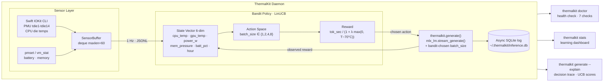

# ThermalKit

Thermal-aware adaptive ML inference throttler for Apple Silicon.

ThermalKit is a macOS daemon that reads your machine's thermal sensors in real time and uses a contextual bandit (LinUCB) to choose inference parameters before the CPU starts throttling — not after. It wraps `mlx_lm.generate()` transparently, so every existing MLX workload benefits without code changes.

---

## The Problem

Every ML inference tool on macOS — Ollama, LM Studio, mlx_lm — runs at full blast. None of them have any awareness of the machine's thermal state. The OS only throttles the CPU after it overheats, which means by the time you notice a drop in tokens-per-second, the damage is already done. You get a sudden cliff in throughput rather than a smooth sustained run.

The issue is that reactive throttling is fundamentally late. By the time the thermal governor cuts clock speeds, the die has already been running hot for seconds. What you want is a system that sees the temperature rising and backs off before the cliff — not a system that reacts after falling off it.

Nobody has built a system that learns the thermal envelope of a specific Apple Silicon machine and proactively shapes inference workloads to stay within it. ThermalKit is that system.

---

## How It All Fits Together

ThermalKit is a closed-loop controller. The sensor layer reads the machine, the bandit policy learns from what it sees, and the inference layer acts on the chosen action — every call feeds back into the policy.



The left side reads the machine (sensors). The middle learns from observations (policy). The right side acts on what it learned (inference), and the result loops back as the next call's reward. The CLI commands give visibility into every layer.

---

## Platform

- macOS, Apple Silicon (M1 / M2 / M3 / M4) — required
- Python 3.11+
- Xcode CLI tools (for Swift compilation)
- MLX 0.31+ and mlx-lm 0.31+

---

## Why This Is Hard to Build

ThermalKit sits at the intersection of three domains that rarely overlap:

**Apple Silicon thermal internals.** IOKit is a private C framework. Python cannot call it directly. The sensor key names differ by chip generation and are not documented anywhere public. The solution is a Swift CLI that uses `@_silgen_name` to bind private IOKit functions by symbol name and streams JSONL to stdout at 1 Hz. Getting a non-zero temperature reading required discovering that the admin-type event client (type 0) is necessary — the simple client (type 2) returns 0.0°C for everything.

**Online learning.** A contextual bandit has to be fast enough to not add meaningful latency to inference calls, robust enough to make reasonable decisions before it has much data, and correct enough that its exploration phase doesn't destroy throughput. The cold-start problem with LinUCB is non-obvious: without a warm-up phase, the first action always dominates because argmax on tied UCB scores always returns index 0, and the first observed reward is large enough to permanently suppress exploration of other arms.

**MLX inference orchestration.** Apple's MLX framework loads model weights onto the GPU at `mlx_lm.load()` time. You cannot switch the compute unit per-call after that — `set_default_device(cpu)` after load is a no-op. The meaningful action axis is `batch_size`, which controls GPU parallelism. Higher batch_size means more throughput in the short term but more heat.

No open-source project addresses all three simultaneously.

---

## Quickstart

```bash
git clone https://github.com/yourusername/thermalkit
cd thermalkit
python3 -m venv venv
source venv/bin/activate
pip install -e .

# Compile the IOKit sensor binary (one-time, requires Xcode CLI tools)
cd thermalkit/sensor/iokit_reader
swiftc main.swift -o iokit_reader
cd ../../..

# Verify everything is working
thermalkit doctor

# Run a benchmark — the bandit starts learning immediately
thermalkit benchmark --rounds 10 --max-tokens 30

# Check what it learned
thermalkit stats
```

---

## CLI Reference

```bash
# Setup and diagnostics
thermalkit doctor                              # validates the full setup, 7 checks
thermalkit status                              # live sensor readings + policy state
thermalkit stats                               # learning dashboard from inference log
thermalkit version                             # print version

# Sensor stream
thermalkit sensor                              # stream live JSONL at 1 Hz, Ctrl-C to stop

# Inference
thermalkit generate "<prompt>"                 # one call, bandit picks batch_size
thermalkit generate "<prompt>" --explain       # same, plus full decision trace
thermalkit generate "<prompt>" --model <id>    # specify a HuggingFace model
thermalkit generate "<prompt>" --max-tokens 200

# Benchmarking
thermalkit benchmark --rounds 10               # N calls, per-round stats + UCB scores
thermalkit benchmark --rounds 20 --max-tokens 30

# Data export
thermalkit export --output data.csv            # export inference log to CSV
thermalkit export --format json --output data.json
thermalkit export --since 2026-06-04 --output recent.csv
```

---

## Using It Programmatically

```python
import mlx_lm
from thermalkit.daemon.daemon import ForgeDaemon

model, tokenizer = mlx_lm.load("mlx-community/Phi-3-mini-4k-instruct-4bit")

with ForgeDaemon(model=model, tokenizer=tokenizer) as daemon:
    response = daemon.generate(
        "Explain thermal throttling in two sentences.",
        max_tokens=100,
    )
    print(response)

    st = daemon.status()
    print(f"batch_size={st['best_action_batch_size']}, reward={st['last_reward']:.1f}")
```

Every call logs sensor state, batch_size, tok/sec, and the thermally-penalised reward to `~/.thermalkit/inference.db`. The policy persists to `~/.thermalkit/policy.npz` and resumes from where it left off across sessions.

---

## Measurements

All numbers are from a MacBook Pro M4 Pro (24 GB) running real MLX inference. Nothing is synthetic.

**batch_size effect on Phi-3-mini-4bit (Phase 2 validation):**

| batch_size | mean tok/sec | mean cpu_temp |
|---|---|---|
| 1 | ~105 tok/s | ~47°C |
| 4 | ~104 tok/s | ~53°C |

Throughput is nearly identical for a small model, but batch_size=4 runs the die 6°C hotter. At that differential, with a larger model or a longer sustained run, the OS thermal governor kicks in and tok/sec collapses. The bandit's job is to learn when to back off before that happens.

**Baseline vs ThermalKit on Llama-3.2-3B-4bit (Phase 5, 30 rounds × 150 tokens):**

| Metric | Baseline | ThermalKit (fresh policy) |
|---|---|---|
| Mean tok/sec | 121.60 | 118.64 |
| P5 tok/sec (floor) | 119.24 | 115.14 |
| Std dev tok/sec | 1.04 | 2.11 |
| Mean cpu_temp | 59.87°C | 65.95°C |
| Throttle events (>92°C) | 0 | 0 |

The 2.4% throughput gap is real daemon overhead — approximately 30ms per call for sensor reads, policy queries, and async SQLite writes. The temperature difference reflects the fact that the fresh-policy run started on a machine that was 9°C warmer from the preceding baseline run. No throttle events occurred in either mode; the M4 Pro has enough thermal headroom for this workload.

**Live benchmark — bandit learning in real time (10 rounds, Phi-3-mini):**

```
Rnd   batch   tok/s      cpu_temp   reward       wall
-------------------------------------------------------
01    1       57.1°C     52.1°C     pending      1.75s   warm-up: explores action 0
02    1       57.3       52.3       pending      1.75s   warm-up: explores action 1
03    1       57.1       51.9       pending      1.46s   warm-up: explores action 2
04    2       67.8       52.4       pending      1.48s   warm-up: explores action 3
05    2       68.1       52.6       97.6 tok/s   1.48s   UCB takes over, picks bs=2
06    2       68.3       52.8       99.2 tok/s   1.50s
07    2       68.2       53.1       100.4 tok/s  1.47s
08    2       68.1       53.0       101.4 tok/s  1.47s
09    2       68.2       53.2       101.9 tok/s  1.50s
10    2       68.3       53.4       102.5 tok/s  1.47s

UCB scores after 10 rounds:
  batch_size=1  69.36     batch_size=2  94.56  (winner)
  batch_size=4  75.50     batch_size=8  69.48
```

The bandit runs four exploration rounds (one per action), then UCB takes over and locks onto batch_size=2. Reward grows from pending to 102.5 tok/s as the rolling 30-second window fills. The policy is saved to disk and picks up from 9 updates on the next session.

---

## The Thermal-Penalty Reward

Raw tok/sec maximises burst throughput. What you actually want is sustained throughput, which means staying away from the temperature range where the thermal governor starts cutting clocks. ThermalKit uses a penalised reward signal:

```
reward = tok_sec / (1.0 + lambda * max(0, cpu_temp - T_threshold))
```

With `lambda=0.05` and `T_threshold=70°C`:

| cpu_temp | tok/sec | reward signal |
|---|---|---|
| 60°C | 100 | 100.0 — no penalty, below threshold |
| 75°C | 100 | 80.0 — 20% penalty |
| 80°C | 100 | 66.7 — 33% penalty |

The policy learns to avoid configurations that run hot even when they produce the same raw throughput. Both values are configurable via environment variables: `THERMALKIT_LAMBDA` and `THERMALKIT_T_THRESH`.

---

## Decision Trace

Pass `--explain` to `thermalkit generate` and the system prints everything it used to make the decision:

```
$ thermalkit generate "what is thermal throttling?" --explain

[thermalkit] Decision Trace
[thermalkit] ────────────────────────────────────────────────────
[thermalkit] State vector:
[thermalkit]   cpu_temp_c        : 60.4°C     → 0.549
[thermalkit]   gpu_temp_c        : 0.0°C      → 0.000
[thermalkit]   power_w           : 0.0W       → 0.000  (powermetrics not configured)
[thermalkit]   mem_pressure_gb   : 8.07GB     → 0.336
[thermalkit]   batt_pct          : 100%       → 1.000
[thermalkit]   hour_of_day       : 11h        → 0.478

[thermalkit] UCB scores (58 prior updates, warmup complete):
[thermalkit]   batch_size=1  →  69.358
[thermalkit]   batch_size=2  →  94.561  <- chosen
[thermalkit]   batch_size=4  →  75.499
[thermalkit]   batch_size=8  →  69.475

[thermalkit] Decision : batch_size=2
[thermalkit] Reason   : UCB winner, warmup complete
[thermalkit] ────────────────────────────────────────────────────

[thermalkit] Result: 101.8 tok/sec  |  200 tokens generated
```

The left column is raw sensor values. The right is what the bandit actually sees after normalisation. The UCB scores show the estimated value of each action given the current thermal state.

---

## System Health Check

```
$ thermalkit doctor

ThermalKit — System Health Check
─────────────────────────────────────────────
✓  Apple Silicon detected: Apple M4 Pro
✓  IOKit binary compiled and executable
     /path/to/thermalkit/sensor/iokit_reader/iokit_reader
✓  Sensors responding
     cpu_temp=55.7°C  gpu_temp=0.0°C  batt=100.0%
✓  MLX 0.31.2 — GPU available, Metal OK
⚠  No policy file yet
     → Run 'thermalkit benchmark' to start learning.
⚠  No inference log yet
     → Created automatically on first generate/benchmark call.
⚠  powermetrics requires sudo password
     → Add sudoers entry for NOPASSWD access (see below).

─────────────────────────────────────────────
4 passed  3 warnings

ThermalKit is ready (with warnings — non-critical).
```

Exits 0 if all critical checks pass. Exits 1 if anything is broken, with a fix hint on each failing line.

---

## Learning Dashboard

```
$ thermalkit stats

ThermalKit Learning Dashboard
────────────────────────────────────────────────────
  Total calls      : 68
  Date range       : 2026-06-04 21:34  →  2026-06-05 10:12

  Throughput
    Mean tok/sec   : 114.3
    Best call      : 122.9 tok/sec
    Worst call     :  99.5 tok/sec
    Trend (L10/F10): +6.8 tok/sec  ↑ improving

  Thermal range
    cpu_temp seen  : 48.2°C – 77.4°C
    Throttle events: 0  (>92°C)

  Bandit
    Policy calls   : 58 updates
    Warmup done    : yes
    Preferred action: batch_size=1 (74% of calls)
    UCB scores     : bs=1→69.4  bs=2→94.6  bs=4→75.5  bs=8→69.5
────────────────────────────────────────────────────
```

---

## powermetrics Configuration (Optional)

ThermalKit works without powermetrics. Battery and memory pressure come from `pmset` and `vm_stat`, which require no elevation. The `power_w` field in the state vector will be 0.0 until powermetrics is configured.

To enable it, add a scoped sudoers entry:

```bash
sudo visudo -f /etc/sudoers.d/thermalkit
```

Add this line (replace `yourusername`):

```
yourusername ALL=(ALL) NOPASSWD: /usr/bin/powermetrics --samplers cpu_power,thermal -i 1000 -f plist
```

---

## Project Structure

```
thermalkit/
├── thermalkit/
│   ├── cli.py                      all CLI commands (doctor, stats, generate, benchmark, export)
│   ├── sensor/
│   │   ├── __init__.py             SensorBuffer — thread-safe ring buffer, 1 Hz fusion
│   │   ├── iokit.py                IOKitReader — subprocess wrapper for the Swift binary
│   │   ├── system_info.py          battery + memory pressure without sudo
│   │   └── iokit_reader/
│   │       ├── main.swift          IOKit thermal sensor CLI — reads PMU tdie1-14, tdev1-8
│   │       └── iokit_reader        compiled binary (gitignored)
│   ├── mlx_wrap/
│   │   ├── _generate.py            thermalkit.generate() — drop-in for mlx_lm.generate()
│   │   ├── tok_sec_meter.py        rolling 30-second reward window
│   │   ├── state_builder.py        sensor readings → normalised numpy vector
│   │   ├── inference_log.py        async SQLite writer — never blocks inference
│   │   └── reward.py               thermal-penalty reward function
│   ├── bandit/
│   │   ├── action_space.py         batch_size actions, feature vectors
│   │   └── policy.py               LinUCB — select, update, save, load, warm-up
│   └── daemon/
│       └── daemon.py               ForgeDaemon — closed-loop controller, context manager
├── tests/
│   ├── test_sensor.py              5 tests
│   ├── test_wrap.py                9 tests
│   ├── test_bandit.py              12 tests
│   ├── test_daemon.py              9 tests
│   ├── test_reward.py              10 tests
│   ├── test_doctor.py              11 tests
│   ├── test_stats.py               7 tests
│   ├── test_explain.py             19 tests
│   └── test_export.py              15 tests
│                                   97 total — 96 pass, 1 skipped
├── benchmarks/
│   ├── eval_baseline.py            raw mlx_lm baseline measurement
│   ├── eval_forge.py               ThermalKit measurement
│   ├── compare.py                  side-by-side comparison and gate check
│   └── results/                    JSON output files (gitignored)
├── PLAN.md
├── pyproject.toml
└── .gitignore
```

---

## Key Design Decisions

**Swift for IOKit.** Python cannot call IOKit C APIs. The Swift binary uses `@_silgen_name` to bind private functions by symbol name. The admin-type event client (type 0) is required — the simple client returns 0.0°C for all sensors.

**batch_size over compute_unit.** MLX places model weights on GPU at load time. Calling `set_default_device(cpu)` after that is a no-op. `batch_size` is the actual knob that trades parallelism (throughput) against GPU load (heat).

**Thermal-penalty reward.** Raw tok/sec teaches the bandit to go fast. Penalised tok/sec teaches it to go fast without running hot. The difference matters on sustained workloads.

**Deferred reward.** The reward for call N is observable only after call N completes. The policy update for call N therefore happens at the start of call N+1. This is the standard temporal structure of online bandit problems.

**LinUCB warm-up.** With all parameters initialised to zero, `argmax` on tied UCB scores always returns index 0. Without explicit warm-up, action 0 dominates permanently. The fix is four rounds of round-robin exploration before UCB takes over.

**SQLite for the inference log.** Zero external dependencies. The file survives daemon restarts, is queryable offline with standard tools, and supports offline bandit replay. The writer runs on a background thread and never blocks inference.

**No-dot venv.** Python 3.13 on macOS APFS explicitly skips `.pth` files inside directories with the `UF_HIDDEN` flag. A venv named `.venv` inherits that flag, causing editable installs to silently fail. The project uses `venv/` instead.

---

## Test Coverage

```bash
python -m pytest tests/ -v
```

96 pass, 1 skipped (the offline replay test skips when no inference database exists on a fresh clone — it is not a failure). All fast tests run without loading a model. Slow tests are marked `@pytest.mark.slow` and load the actual MLX model.
